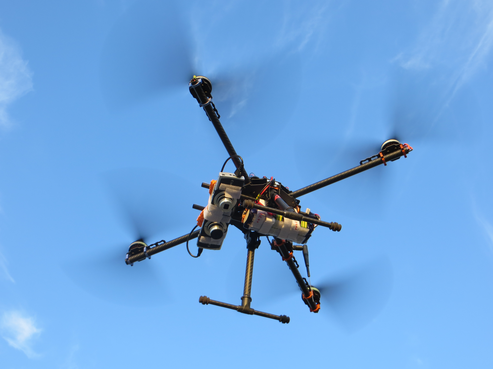
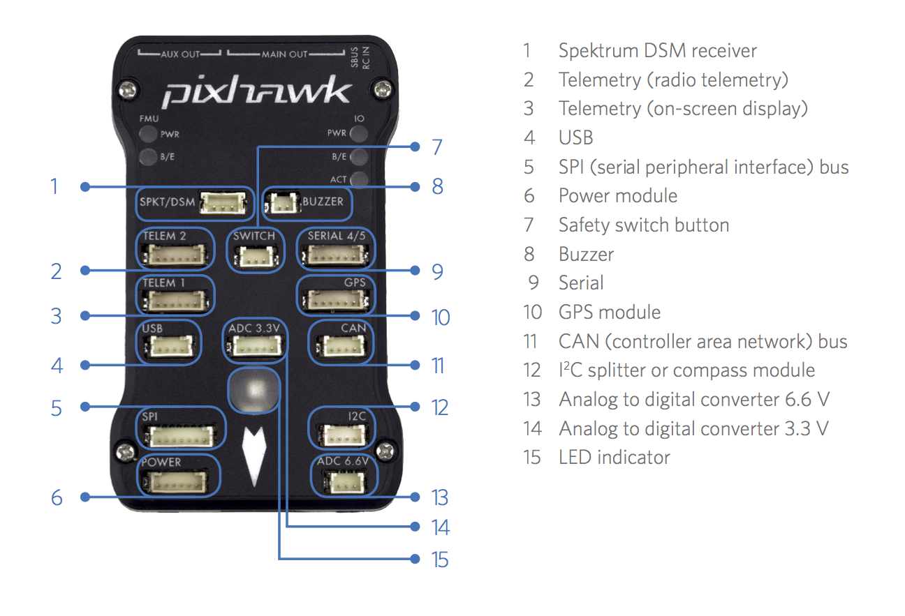
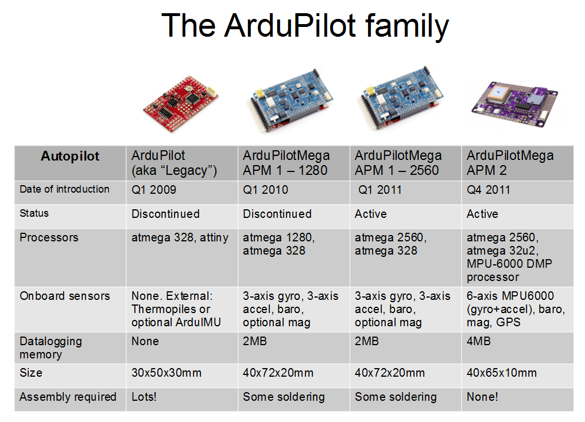
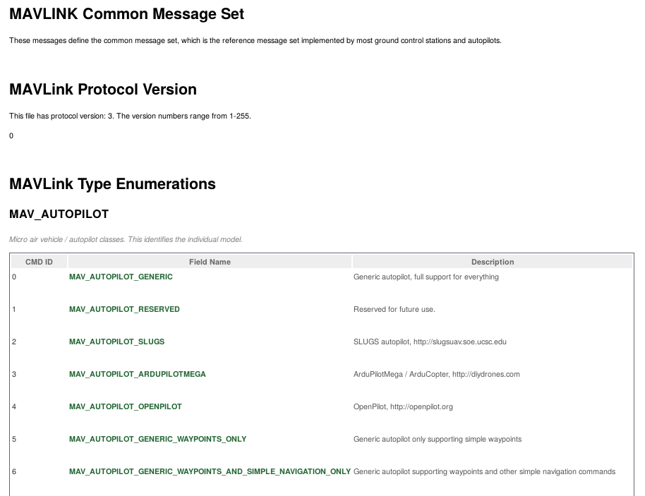
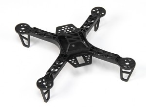
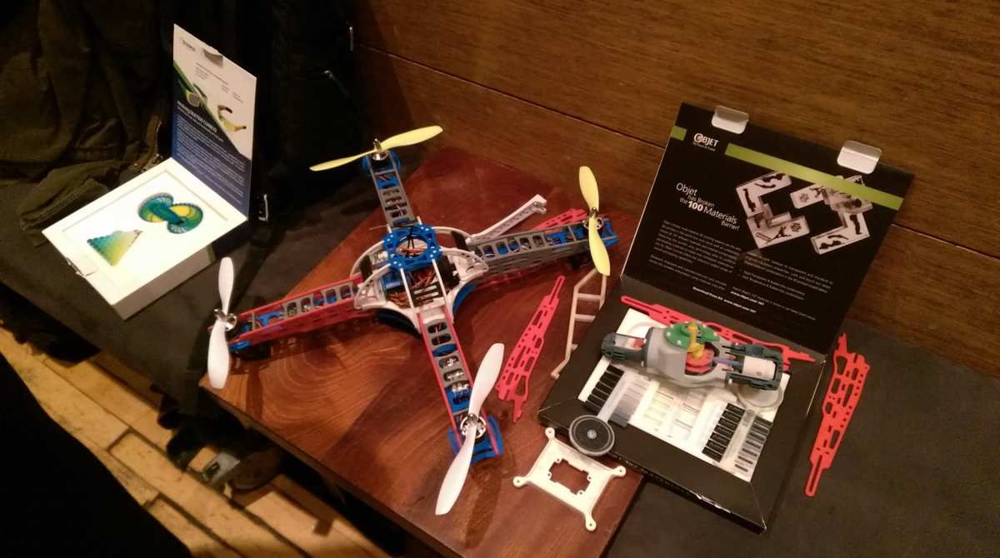
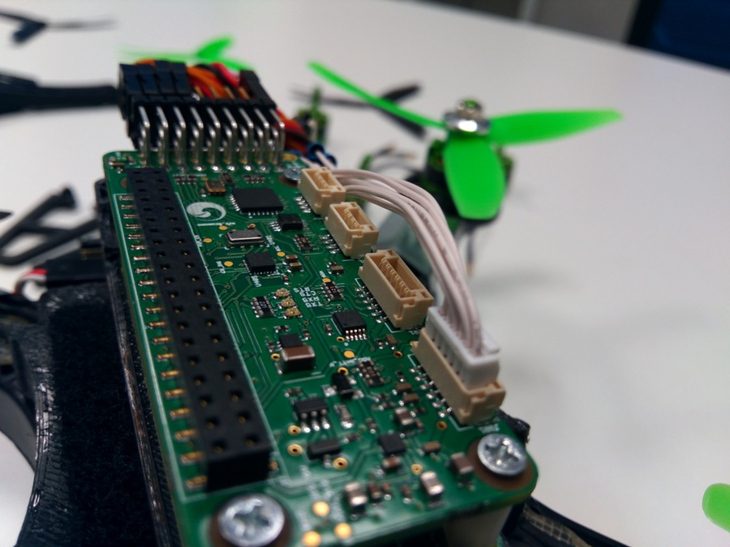

.. -*- coding: utf-8 -*-

####################################################################################################
 Towards An Open Instrumentation Platform: Getting The Most From MAVLink, ArduPilot, and BeagleBone
####################################################################################################

.. Make Magazine: Boston’s 3D Printed Drones Meet Up, by Matt Stultz
   http://makezine.com/2014/12/17/bostons-3d-printed-drones-meet-up/
   or
   https://publiclab.org/notes/gpenzo/03-25-2015/ndvi-cape-for-the-beagle-bone

.. contents:: Presentation Outline
   :depth: 1

.. raw:: pdf

   SetPageCounter

MAVs: Autopilots, Copters, and Drones
=====================================

* Micro Aerial Vehicles and (RC) Copters are not Drones

  * Drones have an autopilot and are (or at least can be) autonomous
  * RC copters (even with an IMU) are generally not fully autonomous

* An autopilot has programmable firmware

  * Usually a microcontroller (typically AVR or ARM)
  * Lots of I/O ports (I2C, SPI, UARTs)
  * Open Firmware: Ardupilot, OpenPilot/LibrePilot, PX4, etc

* Open source hardware: autopilot boards and host machines

  * Ardupilot - BBBMINI Cape/BeaglePilot, PixHawk, PX/4, AUAV-X2, PXFmini, VRBRAIN 4 (supports dual firmware)
  * LibrePilot - CopterControl, CC3D, Revo/Nano, OPLink Mini
  * Autopilot board price range $20 - $200 and up
  * Embedded Linux board price range $5 - $100
  * `$200 Smart Drone`_ "Kit" Using PXFmini and RaspberryPi Zero
  * `$100 DIY Smart Drone`_ using Pi Zero and BYO PXFmini clone

.. _$200 Smart Drone: https://www.hackster.io/12590/pi0drone-a-200-smart-drone-with-the-pi-zero-4fec08
.. _$100 DIY Smart Drone: https://hackaday.io/project/10407-mini-zee-a-100-diy-smart-drone-with-the-pi-zero

.. raw:: pdf

   PageBreak twoColumn

Autopilot Examples
==================

   PixHawk Connectors (top)

.. raw:: pdf

   FrameBreak

.. figure:: images/cc3D.jpg
   :width: 50%
   :align: right

   CopterControl3D

.. raw:: pdf

   Spacer 0 1cm

.. figure:: images/vrbrainpinout3-0.jpg
   :width: 70%
   :align: right

   VR BRAIN 4/5 Connections

.. raw:: pdf

   PageBreak cutePage

MAVLink / Ardupilot Flight Models
=================================

* Original (software) vehicle models in ArduPilot and MAVLink

  - Copter
  - Rover
  - Plane
  - Antenna tracker

* Current vehicle / flight models in MAVLink v1.0/v2.0

  - Generic micro air vehicle
  - Fixed-wing aircraft
  - Single/multi-rotor copters
  - Antenna tracker / ground control station
  - Airship
  - Free balloons, Kites
  - Rocket
  - Ground rover
  - Surface vessel, Submarine
  - Flapping wing

Ardupilot / APM
===============

MAVLink and MAVCONN
===================

MAVLink Protocol and Message Specification
------------------------------------------

*A very lightweight, header-only message marshalling library for micro air vehicles.*

.. raw:: pdf

   Spacer 0 2mm

* `Common MAVLink Message Documentation`_
* `MAVLink Code and Generator`_

There is a “common message set” containing widely used messages, which is distributed
as header-only C library. If you need to add your own custom messages, you can generate
the code with the MAVLink Generator (C/C++) and pymavlink (Python).

MAVCONN Aerial Middleware
-------------------------

*The PIXHAWK MAVOS middleware / robotics toolkit is a heterogenous system consisting of an image processing and communication architecture for computer vision based flight control.*

.. raw:: pdf

   Spacer 0 2mm

* Pixhawk MAVCONN introduction at `EMAV 2009`_ (1st place indoor)
* Fully autonomous flight demonstrated `July 2010`_

.. _Common MAVLink Message Documentation: http://mavlink.org/messages/common
.. _MAVLink Code and Generator: https://github.com/mavlink/mavlink
.. _EMAV 2009: https://pixhawk.ethz.ch/overview/awards
.. _July 2010: https://pixhawk.ethz.ch/micro_air_vehicle/quadrotor/cheetah

MAVLink Message Spec Example
============================

System Architecture
===================

.. raw:: pdf

   Spacer 0 4mm

.. image:: images/mavlink_protocol_links.png
   :align: center
   :scale: 60%

.. raw:: pdf

   Spacer 0 4mm

.. this comment terminates formatting (workaround)

* Full MAVLink/MAVCONN autonomous vehicle configuration
* Linux host system and integrated machine vision/object tracking
* Uses multiple transport/physical layers and redundant GCS links
* Camera X is a third-party camera connected via serial link

Software Stack
==============

.. raw:: pdf

   Spacer 0 4mm

.. figure:: images/mavlink_stack.png
   :scale: 95%

.. raw:: pdf

   Spacer 0 1cm

* MAVConn "middleware" typically runs on onboard Linux host
* Host connects to autopilot and onboard cameras
* MAVLink supports multiple OS/IPC Mechanisms/Interfaces
* MAVLink common messages are extended by autopilot firmware

Message Protocol Routing
========================

.. image:: images/message_routing.png
   :scale: 35%

.. raw:: pdf

   Spacer 0 4mm

* The MAVConn message broadcast includes action, status and command
  messages, which can be used both for onboard and offboard communication
* Messages are identified and filtered by content instead of recipient addresses
* Routing nodes (node 2) filter messages that belong only to a particular
  subset (nodes 3, 4, and 5)

Ground Control
==============

In addition to the onboard software already discussed, we also need a ground
control station, typically used for everything from real-time communication
and tracking to mission/vehicle configuration and flashing new autopilot
firmware images.

Options include:

  * `QGroundControl`_: provides full flight control and mission planning for any
    MAVLink enabled drone and configuration for ArduPilot or PX4 Pro powered vehicles.
  * `Mission Planner`_:  Full featured and widely used open source GCS software
    Platform: Windows, Mac OS X (Using Mono)
  * `APM Planner 2.0`_: smaller user base and reduced feature set when compared with
    Mission Planner but better on Linux.
  * `MAVProxy`_: Linux GCS often used by Plane developers. Primarily a command line
    interface with graphical modules for map and mission editing. Written in Python,
    and extensible via python modules.

.. _QGroundControl: http://www.qgroundcontrol.org/
.. _Mission Planner: https://github.com/ArduPilot/MissionPlanner
.. _APM Planner 2.0: https://github.com/ArduPilot/apm_planner
.. _MAVProxy: https://github.com/ArduPilot/MAVProxy

GPS, IMUs, Sensors, and More
============================

Computer Vision, Cameras and Metadata
=====================================

Still Image Example: FLIR ViewPro IR Camera

* `FLIR Thermal Tiff image file`_ - a TIFF file holding an IR image and corresponding metadata
  (uses extensions provided by `TIFF`_, Exif, and XMP Specifications).

Example MAVLink Interface Requirements:

  :MAV0001: The System Shall_MAV0001 provide a MAVLink-compatible interface for
          querying and storing position and attitude as metadata
  :MAV0002: The System Shall_MAV0002 use only supported autopilot messages
          for 3D position/velocity, camera attitude (look-angle), and associated
          airfrme yaw/pitch/roll angles and speeds.
  :MAV0003: The System Shall_MAV0003 use the MAVLink common message set for
          generic vehicle support.
  :MAV0004: The System Shall_MAV0004 use the MAVConn middleware broadcast
          interface on systems with a Linux host.
  :MAV0005: The System Shall_MAV0005 use the Ardupilot serial stream
          interface on systems with only a Pixhawk autopilot.

.. _FLIR Thermal Tiff image file: http://www.flir.com/uploadedFiles/sUAS/Products/Vue-Pro/FLIR-Interface-Requirements-TIFF.pdf
.. _TIFF: http://partners.adobe.com/public/developer/en/tiff/TIFF6.pdf

.. Frame Grabber / Motion Video Example: Video4Linux2 and OpenCV

.. * `Beaglebone`_ - Video Capture and Image Processing on Embedded Linux
..   (Beaglebone Images, Video and OpenCV - Derek Molloy Electronics)

.. _Beaglebone: http://derekmolloy.ie/beaglebone-video-capture-and-image-processing-on-embedded-linux-using-opencv
.. _Video4Linux2: https://linuxtv.org/downloads/v4l-dvb-apis/
.. _OpenCV: http://docs.opencv.org/

.. raw:: pdf

   PageBreak twoColumn

Airframes and Kits
==================

.. raw:: pdf

   Spacer 0 1cm

.. image:: images/2.jpg
   :align: center
   :width: 75%

.. raw:: pdf

   FrameBreak

.. raw:: pdf

   Spacer 0 2cm

.. raw:: pdf

   Spacer 0 1cm

.. raw:: pdf

   PageBreak cutePage

Other Hardware and Software/Firmware
====================================

* Autonomous 3D-printed Drone

  - http://tinyurl.com/3D-printed-drone

* UAVCAN (a lightweight protocol for aerospace and robotics)

  - https://github.com/uavcan

* The Robot Operating System (ROS)

  - https://github.com/ros

* MicroPython (Python for microcontrollers)

  - https://github.com/micropython/micropython

* RTIMULib2 (C++ and Python 9-dof, 10-dof and 11-dof IMU library)

  - https://github.com/Nick-Currawong/RTIMULib2

* WeatherPi

  - https://github.com/VCTLabs/weather-rpi

* DroneCode.Org UAV repositories

  - https://github.com/Dronecode

Useful (and fun) Applications
=============================

* BeagleBone NDVI Cape  http://tinyurl.com/beaglebone-ndvi

  - Custom hardware and image processing board with dual cameras

* SeaSlug (marine sensor system)  http://tinyurl.com/SeaSlug-pdf

  - A high-uptime, long-deployment mobile marine sensor platform

* GSoC BeagleSat  https://github.com/nvisnjic/BeagleSat

  - An open source nano satellite platform toolkit (a Google Summer of Code project)

* GSoC Sonics https://github.com/Visaoni/beagle-sonic-anemometer

  - An open source anemometer using ultrasonic time of flight (a Google Summer of Code project)

Resources
=========

Ardupilot and MAVLink

  * http://copter.ardupilot.com/
  * https://github.com/mavlink/mavlink
  * https://github.com/mavlink/c_library
  * https://github.com/mavlink/qgroundcontrol
  * https://github.com/mavlink/c_uart_interface_example
  * https://github.com/pixhawk/mavconn
  * https://github.com/diydrones/ardupilot
  * http://tinyurl.com/FLIR-TIFF-MAVLink

Additional Resources

  * https://www.dronecode.org/
  * https://www.librepilot.org/
  * http://dev.ardupilot.com/wiki/building-px4-for-linux-with-make/
  * http://copter.ardupilot.com/wiki/build-your-own-multicopter/
  * http://www.instructables.com/id/DIY-Drones/

References and Specifications
=============================

.. line-block::

       **Huang, Olson and Moore**, Lightweight Communications and Marshalling
           for Low-latency Interprocess Communication. MIT CSAIL Technical
           Report, 2009.
   
       **Lorenz Meier, Petri Tanskanen, Lionel Heng, Gim Hee Lee, Friedrich**
           **Fraundorfer, and Marc Pollefeys**.  Pixhawk: A micro aerial vehicle
           design for autonomous flight using onboard computer vision.
           Autonomous Robots (AURO), 2012.
   
       The canonical MAVLink Common Message Set is common.xml, which defines both the software interface and the `MAVLINK Common Message Set documentation`_.
      
       The ArduPilot "Copter" interface variant is defined in the `ArduCopter GCS_Mavlink.cpp`_ source file.
   
       The `Exif 2.3 Specification`_ - Exchangeable image file format for digital still cameras: Exif Version 2.3, Revised on December, 2012, Camera & Imaging Products Association.
   
       The `XMP 1.0 Specification`_ - XMP Specification, `Part 1`_ (April, 2012), `Part 2`_ (November 2014), `Part 3`_ (November 2014), Adobe Developers Association.

.. _MAVLINK Common Message Set documentation: https://pixhawk.ethz.ch/mavlink/
.. _ArduCopter GCS_Mavlink.cpp: https://github.com/diydrones/ardupilot/blob/Copter-3.3/ArduCopter/GCS_Mavlink.cpp
.. _Exif 2.3 Specification: http://www.cipa.jp/std/documents/e/DC-008-2012_E.pdf
.. _XMP 1.0 Specification: http://www.adobe.com/products/xmp.html
.. _Part 1: http://wwwimages.adobe.com/content/dam/Adobe/en/devnet/xmp/pdfs/XMP%20SDK%20Release%20cc-2014-12/XMPSpecificationPart1.pdf
.. _Part 2: http://wwwimages.adobe.com/content/dam/Adobe/en/devnet/xmp/pdfs/XMP%20SDK%20Release%20cc-2014-12/XMPSpecificationPart2.pdf
.. _Part 3: http://wwwimages.adobe.com/content/dam/Adobe/en/devnet/xmp/pdfs/XMP%20SDK%20Release%20cc-2014-12/XMPSpecificationPart3.pdf

License and Thanks!
===================

:Author: Stephen L Arnold, Principal Scientist @vctlabs.com, developer @gentoo.org
:Contact: stephen.arnold _at_ acm.org
:Revision: 0.3
:Date: |date|, |time| PST8PDT
:License: `CC-Attribution-ShareAlike`_
:Copyright: 2017 `VCT Labs, Inc.`_

.. _CC-Attribution-ShareAlike: http://creativecommons.org/licenses/by-sa/3.0/
.. _VCT Labs, Inc.: http://www.vctlabs.com

.. raw:: pdf

   Spacer 0 5mm

.. image:: images/cc3.png
   :align: left
   :width: .5in

.. |date| date::
.. |time| date:: %H:%M

