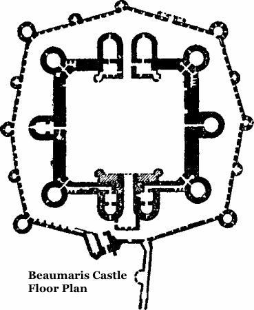

.. -*- coding: utf-8 -*-

###########################################################
 Demote those Security Bugs with a Hardened System Profile
###########################################################

.. contents:: Presentation Outline

.. raw:: pdf

   SetPageCounter

Context: Operational Environment
================================

* Organizational Ethics

  + Policies
  + Controls
  + Monitoring

* Insider Threats

  + Education and Training

* Untrusted Networks

  + Can you have a "trusted" system?

* Minimal Attack Surface

  + Complexity

* Default Deny
* *Defense-in-Depth*
* Reduce Exposure

  + Compartmentalization
  + Least Privelege
  + Insecure-Bootstrap Principle

* Input Validation

.. raw:: pdf

   PageBreak twoColumn

Defense-in-Depth
================

.. raw:: pdf

   Spacer 0 1cm

.. raw:: pdf

   FrameBreak

.. raw:: pdf

   Spacer 0 3cm

*The principle of defense-in-depth is that layered security mechanisms increase security of the system as a whole. If an attack causes one security mechanism to fail, other mechanisms may still provide the necessary security to protect the system.*

.. raw:: pdf

   PageBreak cutePage

Proactive vs. Reactive
======================

Example: Potential 0-day Kernel Exploit
=======================================

*Mishandled Object References in Kernel Keyring* - A 0-day local privilege escalation vulnerability has been identified by the perception point research team. It has been reported that a vulnerability in the keyring facility possibly leads to a local privilege escalation.

* CVE 2016-0728

  - http://www.cve.mitre.org/cgi-bin/cvename.cgi?name=2016-0728

* Original Report

  - http://tinyurl.com/2016-0728

Typical Vendor Responses:

* RedHat, MRG 2 and RHEL 7, Suse Enterprise 11 and below

  - https://bugzilla.redhat.com/show_bug.cgi?id=1297475
  - https://www.suse.com/security/cve/CVE-2016-0728.html

* Gentoo Linux (gentoo-sources, hardened-sources)

  - https://bugs.gentoo.org/show_bug.cgi?id=572384
  - https://bugs.gentoo.org/show_bug.cgi?id=572604

Hardened response - hardened-sources with default settings (in particular CONFIG_PAX_REFCOUNT) significantly reduces the effect of this issue to a local DoS rather than a privilege escalation.

What Does PaX Do?
=================

PaX adds security enhancement to the area between the kernel and user land.

* Automatically enforces memory restrictions and address space randomization on all running processes

  + Can relax certain PaX restrictions on a per ELF object basis
  + Can also be configured to run in SOFTMODE (permit by default)

* Emulates trampolines (mainly for nested functions in C and some JIT compilers)
* Prevents the introduction of new executable pages into running processes
* Kernel land enforcement of *PAGEEXEC* and *MPROTECT* cannot be disabled while running

Old PaX used ELF program header markings, whereas new PaX prefers filesystem extended attributes marking (both are still available in PaX kernel config).

What Exactly is PaX?
====================

PaX is a patch to the Linux kernel that provides additional hardening in three important ways:

1. Judicious enforcement of non-executable memory

   Prevents a common form of attack where executable code is inserted into the
   address space of a process by an attacker and then triggered.  PaX preemptively
   protects against this class of attacks.

2. Address Space Layout Randomization (ASLR)

   Randomization of the memory map of a process (makes it harder for an attacker
   to find the exploitable code within that space). If application is built as a
   Position Independent Executable (PIE), even the base address is randomized.

3. Miscellaneous hardening on stack- and memory handling

   Additional hardening features include erasing the stack frame when returning
   from a system call, refusing to dereference user-land pointers in some contexts,
   detecting overflows of certain reference counters, correcting overflows of some
   integer counters, enforcing the size on copies between kernel and user land,
   and providing extra entropy. 

PaX Kernel Options - NOEXEC Features
====================================

:NOEXEC: This option enables the protection of allocated pages of memory as non-executable if they are not part of the text segment of the running process. It is needed for PAGEEXEC, SEGMEXEC, and KERNEXEC.
:PAGEEXEC: The kernel will protect non-executable pages based on the paging feature of the CPU. This is sometimes called "marking pages with the NX bit" in other OSes.
:SEGMEXEC: This is like PAGEEXEC, but based on the segmentation feature of the CPU and it is controlled by the PaX -S and -s flags (only on x86).
:EMUTRAMP: The kernel will emulate trampolines (snippets of executable code written on the fly) for processes that need them, e.g. nested functions in C and some JIT compilers.
:MPROTECT: The kernel will prevent the introduction of new executable pages into the running process by various techniques.
:KERNEXEC: This is the kernel land equivalent of PAGEEXEC and MPROTECT. It cannot be disabled while the kernel is running. 

PaX Kernel Options - ASLR Features
==================================

:PAX_ASLR: The kernel will expand the number of randomized bits for the various section of the address space. This option is needed for RANDMMAP, RANDKSTACK, and RANDUSTACK.
:RANDMMAP: The kernel will use a randomized base address for mmap() requests that do not specify one via the MAP_FIXED variable. It is controlled by the PaX -R and -r flags.
:RANDKSTACK: The kernel will randomize every task's kernel stack on all system calls. It cannot be disable while the kernel is running.
:RANDUSTACK: The kernel will randomize every task's userland stack. This feature can be controlled on a per ELF binary basis by the PaX -R and -r flags.

PaX Kernel Options - Misc Features
==================================

:STACKLEAK: The kernel will erase its stack before it returns from a system call. This feature cannot be disabled while the kernel is running.
:UDEREF: The kernel will not de-reference userland pointers in contexts where it expects only kernel pointers. This feature cannot be disabled while the kernel is running.
:REFCOUNT: The kernel will detect and prevent overflowing various (but not all) kinds of object reference counters.
:USERCOPY: The kernel will enforce the size of heap objects when they are copied in either direction between the kernel and userland.
:SIZE_OVERFLOW: The kernel recomputes expressions of function arguments marked by a size_overflow attribute with double integer precision.
:LATENT_ENTROPY: The kernel will use early boot code to generate extra entropy, which is especially useful on embedded systems. 

Hardened Toolchain
==================

The Gentoo Hardened project introduces a number of changes to the default behavior of the toolchain (gcc, binutils, glibc/uclibc) intended to improve security. It supports other initiatives taken by the hardened project; most directly PaX and Grsecurity, but can also be applied to SELinux and RSBAC.

* Default addition of the Stack Smashing Protector (SSP)

  The stack smashing protector arranges the code so that a stack overflow
  is very likely to be detected by the application, which then aborts. 

* Automatic generation of Position Independent Executables (PIEs)

  Allows the application to be loaded at a random address; most effective
  when running a PaX kernel with Address Space Layout Randomisation (ASLR).

* Default Mark Read-Only Appropriate Sections (RELRO)

  Causes the linker to include an extra header informing the loader which
  sections can be marked read-only after the loader has finished with them.

* Default full binding at load-time (BIND_NOW)

  Increases the effectiveness of setting RELRO, making attacks that involve
  overwriting data in the Global Offset Table (GOT) fail.

Potential Toolchain Issues and Caveats
======================================

The SSP implementation in gcc-3.x is not perfect, and can cause problems. The SSP implementation in gcc-4.x is completely different, even so far as changing the semantics of the compiler switches (but is in general much better). The standard (non-hardened) toolchain is now enabling SSP and PIE.

Where an application builds libraries without -fPIC, it is necessary to modify the build process to avoid -fPIE being added by the compiler (or patch to build with -fPIC).

Some applications have been reported to segfault when built as PIEs (mostly older versions of gcc).

No issues found so far with switching on RELRO by default. It can make the executable image a little bit bigger (on average by half a page i.e. 2K bytes) which may be of interest for targets with extremely limited memory.

Some packages still have issues with BIND_NOW, and it has to be relaxed somewhat for them:

  * Xorg - some drivers consist of several libraries which are co-dependent, and the modules frequently have references to modules that they load.
  * transcode - relies on lazy binding to be able to load its modules; the issues are similar to the X issues.

Where Can I Get Some?
=====================

Some Hardened Resources
=======================

Hardened Project

* https://wiki.gentoo.org/wiki/Hardened/Introduction_to_Hardened_Gentoo
* https://wiki.gentoo.org/wiki/Hardened/PaX_Quickstart
* https://wiki.gentoo.org/wiki/Hardened/Toolchain
* https://wiki.gentoo.org/wiki/Hardened/PaX_Utilities

Subproject Starters

* https://wiki.gentoo.org/wiki/Project:RSBAC
* https://wiki.gentoo.org/wiki/Project:SELinux

Other Resources

* http://pax.grsecurity.net/
* http://en.wikipedia.org/wiki/NX_bit
* http://people.redhat.com/drepper/dsohowto.pdf

General References and Specifications
=====================================

.. line-block::

     **Engineering Principles for Information Technology Security (EP-ITS)**,
         by Gary Stoneburner, Clark Hayden, and Alexis Feringa, NIST Special
         Publication (SP) 800-27 (PDF)
              
     **Secure Design Principles** from "Foundations of Security: What Every
         Programmer Needs To Know" by Neil Daswani, Christoph Kern, and
         Anita Kesavan (ISBN 1590597842)
           
     **High-Assurance Design** by Cliff Berg, 2005, Addison-Wesley. Foreword
         by Peter G. Neumann. Design principles and patterns for secure and
         reliable design. 

     **DoDI 8500.01**, "Cybersecurity" Information Assurance (IA) guidance.
         http://www.dtic.mil/whs/directives/corres/pdf/850001_2014.pdf

     **DoDI 8510.01**, "Risk Management Framework (RMF) for DoD IT".
         http://www.dtic.mil/whs/directives/corres/pdf/851001_2014.pdf

License and Thanks!
===================

:Author: Stephen L Arnold
:Contact: answers@vctlabs.com
:Revision: 0.1
:Date: 2016-02-11T22:40:06,716796648-0800
:License: `CC-Attribution-ShareAlike`_
:Copyright: 2016 `VCT Labs, Inc.`_

.. _CC-Attribution-ShareAlike: http://creativecommons.org/licenses/by-sa/3.0/
.. _VCT Labs, Inc.: http://www.vctlabs.com

.. raw:: pdf

    Spacer 0 5mm

.. image:: images/cc3.png
   :align: left
   :width: .5in

