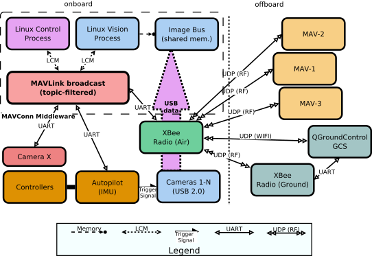
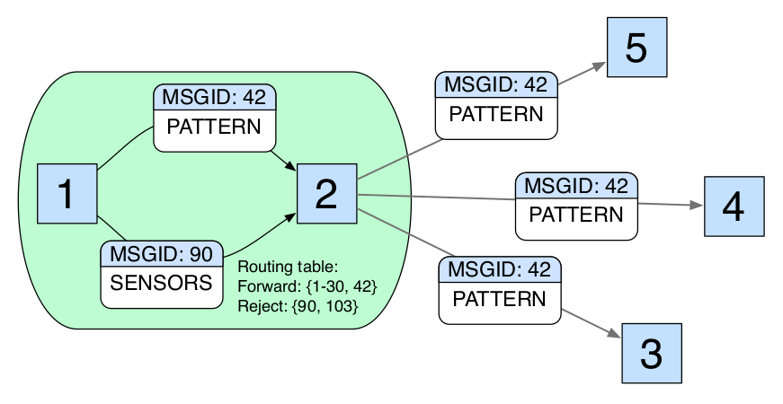

##############################################################
 BYOD? - Putting The Pieces Together For An Open Source Drone
##############################################################

.. image:: images/APM_copter.jpg
   :align: center
   :width: 100%

.. contents:: Presentation Outline

.. raw:: pdf

   PageBreak

Autopilots, Copters, and Drones
===============================

* (RC) Copters are not drones

  * Drones have an autopilot and are (or at least can be) autonomous
  * RC copters (even with an IMU) are not fully autonomous

* An autopilot has programmable firmware

  * Usually a microcontroller (typically AVR or ARM)
  * Lots of I/O ports (I2C, SPI, UARTs)
  * Ardupilot, OpenPilot/LibrePilot, PX4, UAVCAN

* Open source autopilot boards

  * Ardupilot - PixHawk, PX/4, AUAV-X2, PXF/mini, BBBMINI Cape
  * LibrePilot - CopterControl, CC3D, Revo/Nano, OPLink Mini
  * Some autopilots support dual firmware: VRBRAIN 4
  * Price range $20 - $200 and up

.. raw:: pdf

   PageBreak twoColumn

Autopilot Examples
==================

.. figure:: images/pixhawk_connectors_top.png
   :width: 100%
   :align: center

   PixHawk Connectors (top)

.. raw:: pdf

   FrameBreak

.. figure:: images/cc3D.jpg
   :width: 50%
   :align: right

   CopterControl3D

.. raw:: pdf

    Spacer 0 1cm

.. figure:: images/vrbrainpinout3-0.jpg
   :width: 70%
   :align: right

   VR BRAIN 4/5 Connections

.. raw:: pdf

    PageBreak cutePage

Ardupilot / APM
===============

MAVLink and MAVConn
===================

Ground Control
==============

MAVLink System Architecture
===========================

* Full MAVLink vehicle configuration

  * Linux host system and integrated machine vision/object tracking
  * MAVLink uses multiple transport/physical layers and redundant GCS links
  * Camera X is a third-party camera connected via serial link

.. raw:: pdf

    Spacer 0 4mm

The MAVLink Software Stack
==========================

* MAVLink "middleware" typically runs on onboard Linux host
* Host connects to autopilot and onboard cameras
* MAVLink supports multiple OS/IPC Mechanisms/Interfaces
* MAVLink common messages are extended by autopilot firmware

.. raw:: pdf

   Spacer 0 1cm

.. figure:: images/mavlink_stack.png
   :scale: 75%

MAVLink Message Protocol Routing
================================

* The MAVLINK broadcast message format includes action, status and command
  messages, which can be used both for onboard and offboard communication.
* Messages are identified by content instead of recipient addresses.
* Routing nodes (e.g. node 2) filter messages that belong only to a 
  particular subset (eg, nodes 3, 4, and 5).

.. raw:: pdf

   Spacer 0 1cm

Open/Supported Hardware
=======================

GPS, IMUs, Sensors, and More
============================

Computer Vision, Cameras and Metadata
=====================================

Airframes and Kits
==================

and Why You Should Not BYO Airframe
-----------------------------------

Other Vehicles and Software/Firmware
====================================

* UAVCAN https://github.com/uavcan
* ROS https://github.com/ros
* Other repositories https://github.com/Dronecode

Useful (and fun) Drone Applications
===================================

* 

Resources
=========

Ardupilot and MAVLink

   * http://copter.ardupilot.com/
   * https://github.com/mavlink/mavlink
   * https://github.com/mavlink/c_library
   * https://github.com/mavlink/qgroundcontrol
   * https://github.com/mavlink/c_uart_interface_example
   * https://github.com/pixhawk/mavconn
   * https://github.com/diydrones/ardupilot

Additional Resources

   * https://www.dronecode.org/
   * https://www.librepilot.org/
   * http://dev.ardupilot.com/wiki/building-px4-for-linux-with-make/
   * http://copter.ardupilot.com/wiki/build-your-own-multicopter/
   * http://www.instructables.com/id/DIY-Drones/

References and Specifications
=============================

.. line-block::

       **Huang, Olson and Moore**, Lightweight Communications and Marshalling
           for Low-latency Interprocess Communication. MIT CSAIL Technical
           Report, 2009.
   
       **Lorenz Meier, Petri Tanskanen, Lionel Heng, Gim Hee Lee, Friedrich**
           **Fraundorfer, and Marc Pollefeys**.  Pixhawk: A micro aerial vehicle
           design for autonomous flight using onboard computer vision.
           Autonomous Robots (AURO), 2012.

.. raw:: pdf

   Spacer 0 3mm

.. line-block::

   The canonical MAVLink Common Message Set is common.xml, the
   software, which defines the both the software interface and
   the `MAVLINK Common Message Set documentation`_.
      
   The ArduPilot "Copter" interface variant is defined in the
   `ArduCopter/GCS_Mavlink.cpp source file`_.
   
   `Exif 2.3 Specification`_ - Exchangeable image file format for
   digital still cameras: Exif Version 2.3, Revised on December,
   2012, Camera & Imaging Products Association.
   
   `XMP 1.0 Specification`_ - XMP Specification, `Part 1`_ (April, 2012),
   `Part 2`_ (November 2014), `Part 3`_ (November 2014), Adobe Developers
   Association.

.. _MAVLINK Common Message Set documentation: https://pixhawk.ethz.ch/mavlink/
.. _ArduCopter/GCS_Mavlink.cpp source file: https://github.com/diydrones/ardupilot/blob/Copter-3.3/ArduCopter/GCS_Mavlink.cpp
.. _Exif 2.3 Specification: http://www.cipa.jp/std/documents/e/DC-008-2012_E.pdf
.. _XMP 1.0 Specification: http://www.adobe.com/products/xmp.html
.. _Part 1: http://wwwimages.adobe.com/content/dam/Adobe/en/devnet/xmp/pdfs/XMP%20SDK%20Release%20cc-2014-12/XMPSpecificationPart1.pdf
.. _Part 2: http://wwwimages.adobe.com/content/dam/Adobe/en/devnet/xmp/pdfs/XMP%20SDK%20Release%20cc-2014-12/XMPSpecificationPart2.pdf
.. _Part 3: http://wwwimages.adobe.com/content/dam/Adobe/en/devnet/xmp/pdfs/XMP%20SDK%20Release%20cc-2014-12/XMPSpecificationPart3.pdf

License and Thanks!
===================

| 
|   Stephen Arnold - Gentoo / OpenEmbedded Developer
| 
|     * Principal Scientist / System Architect @ VCT Labs
| 
|     * answers _at_ vctlabs.com
| 
| 
| 
|   Presentation released under license CC-Attribution-ShareAlike
| 
|     http://creativecommons.org/licenses/by-sa/3.0/

.. raw:: pdf

    Spacer 0 2cm

.. image:: images/cc3.png
   :align: left
   :width: .5in

